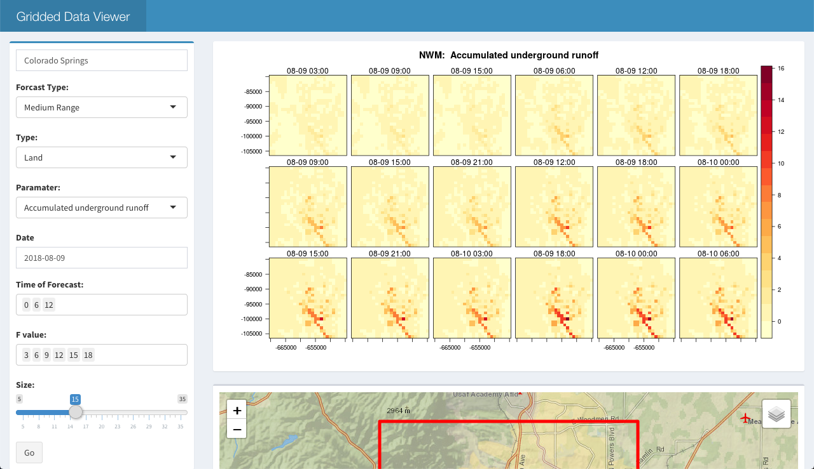

# nwmViewer

nwmViewer is an R Shiny application built to quickly view and analyze NOAA National Water Model data.  

Users can select their location, forecasting types and paramaters.

## Web application

[nwmViewer](https://nwmviewer.shinyapps.io/view/)

## Preview



## Installation

In addition to the web application, you can run the application locally. Use the following commands for installation:

```r
install.packages("devtools")
devtools::install_github("overdodactyl/nwmViwer")
```

## Use

Launch the application:

```r
library(nwmViewer)
launch_viewer()
```

# Similar Projects

* [FlowFinder](https://mikejohnson51.github.io/FlowFinder/)

## Core Packages

* [nwm](https://mikejohnson51.github.io/NWM/)
* [R Shiny](https://www.rstudio.com/products/shiny/)